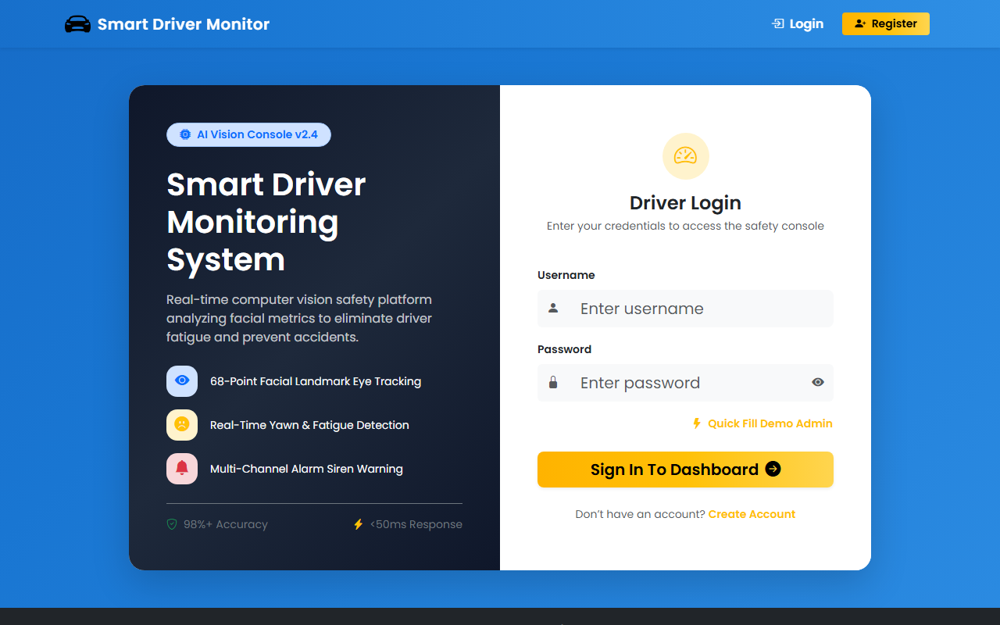
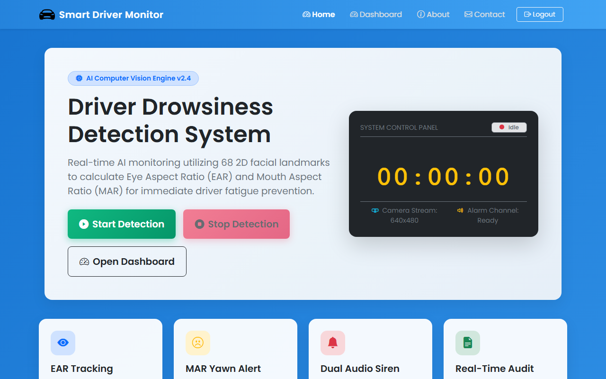
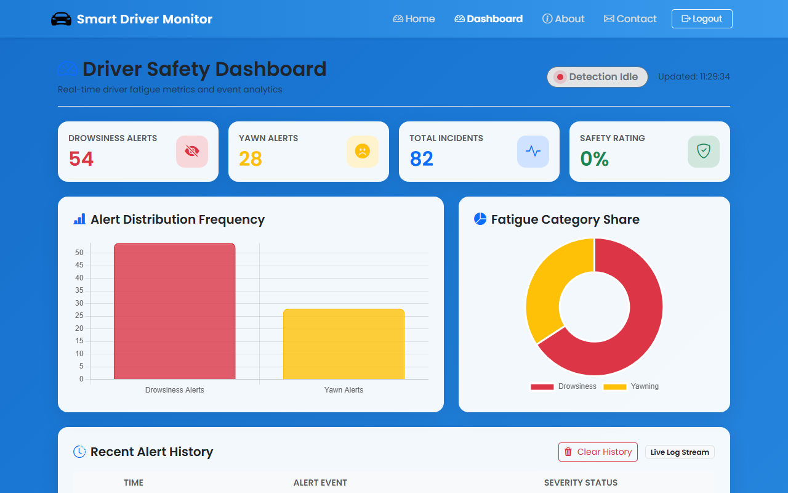
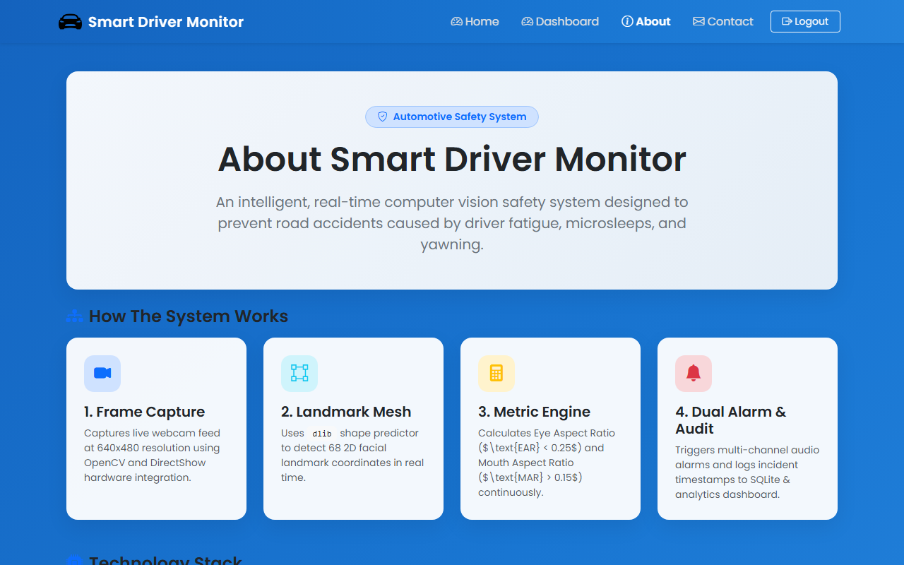

# 🚗 Smart Driver Drowsiness Detection System

A real-time AI-powered Driver Drowsiness & Yawn Detection System developed using **Python, OpenCV, dlib, Flask, Chart.js, SQLite, and Pygame**. The system continuously monitors a driver's face via webcam feed, calculates real-time Eye Aspect Ratio ($\text{EAR} < 0.27$) and Mouth Aspect Ratio ($\text{MAR} > 0.15$), issues dual audio alarm sirens, and logs incidents to an interactive analytics dashboard.

---

## 📌 Key Features

- 🔒 **Dynamic SQLite Authentication**: Secure registration & login system with Werkzeug password hashing.
- 👁️ **68-Point Real-Time Facial Landmark Tracking**: Precise sub-second eye closure detection using `dlib`.
- 😴 **Automated Drowsiness & Microsleep Alarm**: Triggers an emergency alarm siren when eyes remain closed.
- 🥱 **Yawn & Fatigue Monitoring**: Detects sustained yawning aperture ($\text{MAR} > 0.15$).
- 📊 **Interactive Chart.js Analytics Dashboard**: Real-time distribution bar & doughnut frequency charts, 4 stat cards, and safety rating scores.
- 🎥 **Live Web Stream & HUD Console**: Embedded in-browser video stream alongside desktop OpenCV window.
- 📜 **Audit Ledger & Live Incident Feed**: Real-time event logging with single-click log history clearing.
- ⚡ **DirectShow Camera Backend**: Optimized Windows webcam stream buffer (`cv2.CAP_DSHOW`).

---

## 🛠️ Technology Stack

- **Computer Vision & AI**: Python 3.10, OpenCV, dlib 68-landmark shape predictor, imutils, SciPy, NumPy.
- **Backend & Database**: Flask 3.x, Flask-Session, SQLite3, Werkzeug Security.
- **Frontend & Visualizations**: Chart.js, Bootstrap 5.3, Bootstrap Icons, Glassmorphism CSS.
- **Audio & Multithreading**: Pygame Sound Mixer, Python `threading` module.

---

## 📂 Project Structure

```
Driver-Drowsiness-Detection-System/
│
├── static/
│   ├── css/
│   │   └── style.css
│   └── images/
│       └── logo.png
├── templates/
│   ├── base.html
│   ├── index.html          # Executive Home Control Console
│   ├── dashboard.html      # Interactive Chart.js Safety Dashboard
│   ├── about.html          # System Architecture & Performance Metrics
│   ├── contact.html        # Project Support & Inquiries
│   ├── login.html          # Dual-Panel Login Page
│   └── register.html       # Driver Onboarding Registration Page
├── Screenshots/
│   ├── 01_login_page.png
│   ├── 02_register_page.png
│   ├── 03_home_control_console.png
│   ├── 04_camera_live_monitoring.png
│   ├── 05_dashboard_analytics.png
│   ├── 06_about_page.png
│   └── 07_contact_page.png
├── app.py                  # Flask Application Server & Auth Middleware
├── final_drowsiness.py     # OpenCV & dlib Computer Vision Engine
├── control.py              # Shared Detection State Flag
├── users.db                # SQLite Driver Credentials Database (Auto-Created)
├── alert_log.txt           # Incident Event Audit Log
├── requirements.txt        # Python Dependencies
└── README.md               # Project Documentation
```

---

## ⚙️ Installation & Usage

### 1. Clone the repository

```bash
git clone https://github.com/arjunit09/Driver-Drowsiness-Detection-System.git
cd Driver-Drowsiness-Detection-System
```

### 2. Create and Activate Virtual Environment (Optional)

```bash
# Windows
python -m venv venv
venv\Scripts\activate

# Linux / macOS
python3 -m venv venv
source venv/bin/activate
```

### 3. Install Dependencies

```bash
pip install -r requirements.txt
```

### 4. Facial Landmark Model Setup

Ensure `shape_predictor_68_face_landmarks.dat` is placed in the project root directory.

### 5. Launch Application Server

```bash
python app.py
```

Open your browser and navigate to: **http://127.0.0.1:5000**

---

## 📸 System Screenshots

### 🔒 Login & Authentication Console


### 🏎️ Executive Home Control Console & Live Camera Stream


### 📊 Interactive Chart.js Safety Dashboard


### ℹ️ System Architecture & Technology Showcase


---

## 👨‍💻 Maintainer

**Arjun**  
B.Tech Information Technology Student  
GitHub: [https://github.com/arjunit09](https://github.com/arjunit09)

---

## 📄 License

This project is developed for educational and safety research purposes.